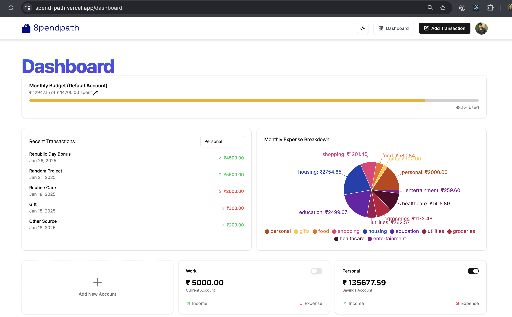

# SpendPath
 

**SpendPath** is a full-stack AI-powered finance management platform designed to simplify and optimize your financial journey. This project leverages modern technologies to provide seamless financial insights and effortless transaction management, with a robust and scalable architecture. Deployed live on [click](https://spend-path.vercel.app/), SpendPath ensures top-notch performance and accessibility.

---

## Features

### Core Features
- **AI-Powered Insights**: Intelligent tools to analyze spending patterns and provide actionable financial insights.
- **Transaction Management**: Effortlessly track, categorize, and visualize every transaction.
- **Real-Time Updates**: Stay updated with live data synchronization across all devices.
- **Secure Authentication**: Seamless and secure user authentication via Clerk.
- **Event-Driven Architecture**: Inngest ensures robust workflows and event handling.

### User Interface
- **Responsive Design**: Built with Tailwind CSS for a modern, mobile-first experience.
- **Shadcn UI Components**: Elegant and reusable UI components powered by Arcjet.
- **Interactive Dashboard**: Visualize transaction history, spending patterns, and budgets in real-time.

---


## Screenshots

### Landing Page
  
[View Landing Page Live](https://spend-path.vercel.app)

### Dashboard
 
[View Dashboard Live](https://spend-path.vercel.app/dashboard)

### AccountInfo Page
  
[View AccountInfo Page Live](https://spend-path.vercel.app/account)

### Transaction Page
  
[View Transaction Page Live](https://spend-path.vercel.app/transaction/)

---

## Technologies Used

### Frontend
- **React 19**: Component-based architecture for building scalable user interfaces.
- **Next.js 15**: Server-side rendering and API routes for optimized performance.
- **Tailwind CSS**: Utility-first framework for responsive and modern styling.
- **Shadcn UI**: Beautiful, pre-built components for a consistent user interface.

### Backend
- **Supabase**: A powerful Postgres-based backend for authentication and database management.
- **Prisma**: Modern ORM for seamless database operations and type-safe queries.
- **Inngest**: Event-driven framework for handling workflows and real-time processes.

### Authentication & Deployment
- **Clerk**: Simplified and secure authentication and user management.
- **Vercel**: Deployment platform offering fast and reliable hosting.

---

## Deployment

SpendPath is live and accessible on [Vercel](https://vercel.com). Vercel’s platform ensures top performance with serverless deployments, automatic scaling, and instant previews.

### Live Demo
Experience the full platform: [SpendPath Live](https://spend-path.vercel.app)

---

## Getting Started

To set up and run the Modern_Todo development server:
### Installation Steps

1. Clone the repository:
   ```sh
   git clone https://github.com/mohitsingh4716/SpendPath.git
   ```

2. Navigate to the project directory:
    ```sh
    cd spendpath
   ```

3. Add .env file(root folder)
   ```sh
        NEXT_PUBLIC_CLERK_PUBLISHABLE_KEY=
        CLERK_SECRET_KEY=

        NEXT_PUBLIC_CLERK_SIGN_IN_URL= sign-in
        NEXT_PUBLIC_CLERK_SIGN_UP_URL= sign-up

        DATABASE_URL=
        DIRECT_URL=

        GEMINI_API_KEY=
        RESEND_API_KEY=
        ARCJET_KEY=
    ```   
4. Install NPM packages
   ```sh
   npm install --legacy-peer-deps
    ```
5. Run the development server:
   ```sh
   npm run dev 
    ```

 Start the development server.
 Open [ http://localhost:3000/]( http://localhost:3000/) in your browser to access the application.

---
